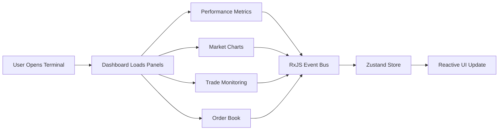

<div align="center">

  

  <br />
  <br />

  <a href="#">
    
  </a>
  <a href="#">
    
  </a>
  <a href="#">
    
  </a>

  <br />
  <br />

  <div style="overflow: hidden; border-radius: 10px; box-shadow: 0px 4px 20px rgba(0,0,0,0.5); margin-bottom: 20px;">
    
  </div>

  <br />

  <h1 style="font-size: 3rem; margin-bottom: -10px;">DEEPTRADE</h1>

  <a href="https://git.io/typing-svg">
  
  </a>

  <p align="center">
    <b>Real-Time. Intelligent. Immersive.</b><br />
    A modern web terminal designed for monitoring financial markets and detecting trading signals.
  </p>

</div>

---

# • The Hackathon Vision

> *"Markets never sleep. Analysts need tools that move just as fast."*

**DeepTrade** was built as part of the **ACM ReCode Hackathon challenge**, where the goal was to redesign and rebuild modern analytical interfaces.

Instead of building a static dashboard, we created a **dynamic terminal environment** where information streams continuously and multiple panels react to market signals in real time.

| Timeline | Milestone | Status |
| :--- | :--- | :--- |
| *0-4 hrs* | UI/UX Design & Terminal Layout | ✅ |
| *4-8 hrs* | Panel System & Dashboard Components | ✅ |
| *8-12 hrs* | Real-Time Charts & Market Metrics | ✅ |
| *Future* | Live Market APIs & AI Signal Detection | ⏳ |

---

# • Tech Stack

We built DeepTrade using a **modern frontend architecture optimized for speed and scalability**.

<div align="center">
  <a href="https://skillicons.dev">
    
  </a>
</div>

### Frontend
- **Framework:** Next.js 15 (App Router)
- **Styling:** Tailwind CSS
- **Animations:** Framer Motion
- **Icons:** Lucide React

### State Management
- **Global Store:** Zustand
- **Event Bus:** RxJS (Reactive Terminal Signals)

### Visualization
- Advanced Candlestick, Bar, and Line charts for financial analytics

### Deployment
- Vercel

---

# • Key Features

##  Real-Time Market Terminal
DeepTrade provides a **multi-panel analytical dashboard** that simulates professional trading terminals used by analysts.
- Live performance metrics
- Dynamic financial charts (Candle / Bar / Line)
- Trading analytics & History
- Market depth monitoring

## Performance Tracking
The dashboard tracks performance across different timeframes:
- Weekly / Monthly / Yearly / All-time statistics
- Real-time Balance & PnL tracking
- Dynamic risk/reward assessment

##  AI Whisper Alerts
DeepTrade includes **AI-driven anomaly detection signals** that highlight unusual market activity.
- Price shock detection
- Sudden market movement
- Abnormal trading behavior
- Insider flow detection

## Multi-Panel Analytical Workspace
The terminal is divided into **independent analytical panels**, such as:
- **Market Charts:** High-frequency data visualization.
- **Trade Monitoring:** Live execution tracking.
- **Order Book:** Real-time liquidity depth.
- **Watchlists:** Instant access to trending assets.

---

# • Demo & Screenshots

| Landing Page | Terminal Dashboard |
| :---: | :---: |
|  |  |

| Features | About Section |
| :---: | :---: |
|  |  |

---

# • Local Setup

1. **Clone the repository:**
   ```bash
   git clone https://github.com/shivam-salkar/acm-recode.git
   ```
2. **Install dependencies:**
   ```bash
   npm install
   ```
3. **Run the development server:**
   ```bash
   npm run dev
   ```
4. **Build for production:**
   ```bash
   npm run build
   ```

---

# • Architecture & Data Flow

The system follows a **modular architecture**, separating UI components from data logic via a reactive event-driven approach.



---

# • Team helloworld

- **Shivam Salkar** ([GitHub](https://github.com/shivam-salkar))
- **Srushti Gaikwad** ([GitHub](https://github.com/tech162))
- **Soham Yadav** ([GitHub](https://github.com/Dynapar))

---
<div align="center">
  Built with 💙 for the <b>ACM ReCode Hackathon</b>
</div>

